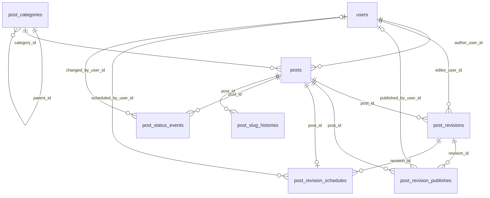
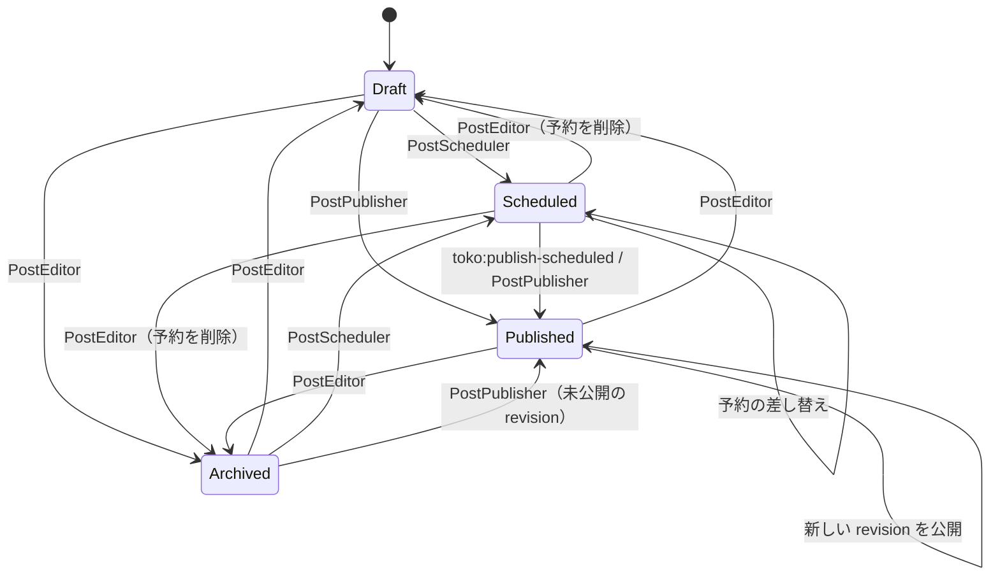

# Toko

Laravel 向けの記事管理モデル & サービスパッケージです。階層カテゴリ、記事、不変のリビジョン、公開履歴、予約公開、ステータス監査ログ、slug 履歴を提供します。

English version: [README.md](README.md)

## 目次

- [特徴](#特徴)
- [動作要件](#動作要件)
- [インストール](#インストール)
- [基本概念](#基本概念)
- [ステータスのライフサイクル](#ステータスのライフサイクル)
- [クイックスタート](#クイックスタート)
- [サービス](#サービス)
- [予約公開](#予約公開)
- [データの取得](#データの取得)
- [slug 履歴](#slug-履歴)
- [イベント](#イベント)
- [設定](#設定)
- [ステータスのラベルと色](#ステータスのラベルと色)
- [ユーザーモデル](#ユーザーモデル)
- [サービスの差し替え](#サービスの差し替え)
- [Factory と Seeder](#factory-と-seeder)
- [Laravel Boost 連携](#laravel-boost-連携)
- [アップグレード](#アップグレード)
- [開発](#開発)

## 特徴

- **階層カテゴリ**: 親子関係と並び順を持ち、記事と件数を一緒に取得するツリー構築ヘルパーがあります。
- **記事とリビジョン**: `Post` は現在（公開中）の値を持ちます。編集のたびに不変の `PostRevision`（TipTap JSON + 描画済み HTML）が作られます。
- **公開ワークフロー**: 作成・更新、公開、予約、復元のサービスを提供します。どれもトランザクション内で動き、DB に書き込む前に入力を検証します。
- **予約公開**: artisan コマンドで期限の来た記事を公開します。失敗は記事ごとに切り離されます。
- **監査ログ**: 公開履歴（どの revision を、いつ、誰が公開したか）とステータス遷移を記録します。
- **slug 履歴**: 旧 slug を自動で記録し、301 リダイレクトに使えます。
- **イベント**: 公開、ステータス変更、slug 変更で発火します。
- **Filament 対応**: `PostStatus` enum は翻訳可能なラベルと色を持ちます。

## 動作要件

- PHP 8.3+
- Laravel 12
- 整数主キーの `users` テーブル（外部キーが `users.id` を参照します）

## インストール

```bash
composer require trust-medical/toko
```

サービスプロバイダは自動検出されます。マイグレーションを実行してください。

```bash
php artisan migrate
```

必要に応じて設定ファイルと翻訳ファイルを公開します。

```bash
php artisan vendor:publish --tag=toko-config
php artisan vendor:publish --tag=toko-translations
```

予約公開を使う場合は、コマンドを Laravel のスケジューラに登録してください（[予約公開](#予約公開) を参照）。

## 基本概念

| Model / Enum | 責務 |
| --- | --- |
| `PostCategory` | 階層カテゴリ（隣接リスト `parent_id`、`sort_order`）。 |
| `Post` | 記事の現在値。著者、カテゴリ、タイトル、抜粋、slug、ステータス、`published_at`、`scheduled_at` を持つ。 |
| `PostRevision` | 本文の不変のバージョン。タイトル、抜粋、slug、`content_json`（TipTap）、`content_html`、エディタ情報を持つ。 |
| `PostRevisionPublish` | 公開履歴。どの revision を、いつ、誰が公開したか（システムによる公開では公開者は null）。 |
| `PostRevisionSchedule` | 記事の予約公開（1 記事につき最大 1 件）。 |
| `PostStatusEvent` | ステータス遷移の監査ログ（from/to、変更者、日時、メモ）。 |
| `PostSlugHistory` | 記事の旧 slug（リダイレクト用）。 |
| `PostStatus` | Enum: `Draft`（0）、`Scheduled`（1）、`Published`（2）、`Archived`（3）。 |

モデルは `TrustMedical\Toko\Models`、enum は `TrustMedical\Toko\Enums` にあります。

考え方:

- **本文の正本は revision です。** 記事を編集すると新しい revision ができます。revision を公開すると、その `title` / `excerpt` / `slug` が `Post` にコピーされます。revision 側の値が `null` なら、記事の現在値がそのまま残ります。
- **公開中の記事は公開によってのみ変わります。** 公開中は `Post` の `title` / `excerpt` / `slug` を直接更新しません。新しい revision を保存して公開してください。
- **1 つの revision は 1 回だけ公開できます。** 同じ revision は二度公開できません。古い revision を戻したいときは、復元（新しい revision が作られる）してからそれを公開します。
- **状態遷移はサービスを使ってください。** モデルは普通の Eloquent モデルなので `status` を直接書き換えることもできます。ただし、公開履歴・予約・ステータスイベントの整合性を保てるのはサービスだけです。

### ER 図



## ステータスのライフサイクル



ルール:

- `Published → Scheduled` は **できません**。公開中の記事の更新を予約したい場合は、いったん非公開にするか、新しい revision の準備ができた時点で公開してください。
- 再公開（`Published → Published`）と予約の差し替え（`Scheduled → Scheduled`）では、ステータスが変わらないため `PostStatusEvent` を記録せず、`PostStatusChanged` も発火しません。公開履歴は毎回記録されます。
- `Scheduled` から他のステータスに移ると、予約レコードが削除され `scheduled_at` がクリアされます。
- `published_at` には未来の日時も指定できます。その場合、記事は `Published` ですが、その時刻になるまで `visible()` には含まれません。

## クイックスタート

```php
use TrustMedical\Toko\Contracts\PostEditorContract;
use TrustMedical\Toko\Contracts\PostPublisherContract;
use TrustMedical\Toko\Contracts\PostRevisionRestorerContract;
use TrustMedical\Toko\Enums\PostStatus;
use TrustMedical\Toko\Models\PostCategory;

$category = PostCategory::create(['name' => 'News', 'slug' => 'news']);
$editor = app(PostEditorContract::class);
$user = auth()->user();

// 1. 下書きを作成（記事 + 最初の revision）
$post = $editor->create(
    ['category_id' => $category->id, 'slug' => 'hello-toko'],
    [
        'title' => 'Hello Toko',
        'content_json' => $tiptapJson,
        'content_html' => $html,
    ],
    author: $user,
);

// 2. 下書きの revision をもう 1 つ保存
$post = $editor->update($post, [], [
    'title' => 'Hello Toko (v2)',
    'content_json' => $tiptapJson,
    'content_html' => $html,
], $user);

// 3. 最新の revision を公開
$post = $editor->update($post, ['status' => PostStatus::Published], [], $user, 'First release');

// 4. 後日: 公開中の記事の誤字を直して公開
$post = $editor->update($post, [], ['title' => 'Hello, Toko', 'content_json' => $tiptapJson, 'content_html' => $html], $user);
app(PostPublisherContract::class)->publish($post, $post->revisions()->latest('id')->first(), $user);

// 5. 最初の revision に戻す
$first = $post->revisions()->oldest('id')->first();
$restored = app(PostRevisionRestorerContract::class)->restore($post, $first, $user);
app(PostPublisherContract::class)->publish($post->fresh(), $restored, $user, note: 'Rollback');
```

## サービス

サービスは contract 経由で取得します（`app(...)` またはコンストラクタインジェクション）。`TokoServiceProvider` がシングルトンとして登録しています。

入力が不正なら、何かを書き込む前に `InvalidArgumentException` を投げます。どのサービスもトランザクション内で動きます。

### PostEditor

`TrustMedical\Toko\Contracts\PostEditorContract`: フォームや管理画面向けの高レベル API です。

```php
create(array $postAttributes, array $revisionAttributes, ?Model $author = null, ?Model $editor = null, ?string $note = null): Post
update(Post $post, array $postAttributes = [], array $revisionAttributes = [], ?Model $changedBy = null, ?string $note = null): Post
```

**`create()`**

- 記事を **`Draft` として** 最初の revision と一緒に作成します。指定された `status`（なければ `config('toko.default_status')`）が `Draft` 以外なら、その後 Publisher、Scheduler、またはステータスイベントでそのステータスへ移します。
- `author_user_id`（または `$author`）と `category_id` は必須です。
- `title` / `excerpt` / `slug` は revision 属性と記事属性で互いに補完されます。
- revision の編集者は、revision 属性の `editor_user_id`、なければ `$editor`、なければ `$author` です。
- `status => Scheduled` には `scheduled_at` が必要です。`status => Published` では `published_at` を任意で指定できます。

**`update()`**

- 記事属性を先に保存します。記事が `Published`（またはこれから `Published` になる）場合、`title` / `excerpt` / `slug` はここでは **無視** されます。これらは revision の公開時に反映されます。
- `$revisionAttributes` が空でなければ新しい revision を作ります。
- `status` を `Published` / `Scheduled` に変えるときは、新しく作った revision を使い、なければ記事の **最新の revision** を使います。
- `Scheduled` の間は、`scheduled_at`、新しい revision、`$note` のどれかを渡すと `PostScheduler` 経由で予約し直すので、同じ検証がかかります。`$changedBy` が必要です。
- `scheduled_at` は `Scheduled` のときだけ反映し、`published_at` は `Scheduled` の間は無視します。

### PostPublisher

`TrustMedical\Toko\Contracts\PostPublisherContract`

```php
publish(Post $post, PostRevision $revision, ?Model $publishedBy = null, ?DateTimeInterface $publishedAt = null, ?string $note = null): PostRevisionPublish
```

- revision がその記事のもので、`content_html` を持ち（設定で変更可）、まだ公開されていないことが条件です。
- `PostRevisionPublish` を作り、`title` / `excerpt` / `slug` を記事にコピーします。`status = Published` と `published_at`（既定は `now()`）を設定し、予約があれば削除します。
- システムによる公開では `$publishedBy` を `null` にできます。
- ステータスが実際に変わったときだけ、ステータスイベントを記録して `PostStatusChanged` を発火します。`PostPublished` は毎回発火します。

### PostScheduler

`TrustMedical\Toko\Contracts\PostSchedulerContract`

```php
schedule(Post $post, PostRevision $revision, DateTimeInterface $scheduledAt, ?Model $scheduledBy = null, ?string $note = null): PostRevisionSchedule
```

- `$scheduledBy` と、`content_html` を持つ（設定で変更可）その記事の revision が必要です。また、記事が `Published` でないことが条件です。
- 予約を保存し（1 記事 1 件で、既存の予約は置き換え）、`status = Scheduled` と `scheduled_at` を設定し、`published_at` をクリアします。

### PostRevisionRestorer

`TrustMedical\Toko\Contracts\PostRevisionRestorerContract`

```php
restore(Post $post, PostRevision $revision, ?Model $restoredBy = null, ?string $note = null): PostRevision
```

- revision の内容を **新しい** revision にコピーします。既定の変更メモは `Restore from revision #<id>` です。
- 記事が公開中でなければ、記事の `title` / `excerpt` / `slug` をすぐに更新します。公開中なら、返された revision を公開すると反映されます。

## 予約公開

```bash
php artisan toko:publish-scheduled            # 最大 100 件
php artisan toko:publish-scheduled --limit=500
```

- `Scheduled` で `scheduled_at` を過ぎた記事を、予約日時の古い順に取り出し、予約された revision を公開します。`published_at` には `scheduled_at` が入ります。
- 1 件ごとにロックし、それぞれ別のトランザクションで公開します。ある記事で失敗しても（本文がない場合など）エラーを報告して次の記事に進み、最後に 0 以外の終了コードを返します。
- 予約したユーザーがもういない場合でも、公開者 `null` として公開します。

`routes/console.php` に登録します。

```php
use Illuminate\Support\Facades\Schedule;

Schedule::command('toko:publish-scheduled')
    ->everyMinute()
    ->withoutOverlapping();
```

cron から Laravel のスケジューラを動かします（ローカルでは `php artisan schedule:work` でも動きます）。

```bash
* * * * * cd /path-to-your-project && php artisan schedule:run >> /dev/null 2>&1
```

## データの取得

### Post のスコープ

| スコープ | 意味 |
| --- | --- |
| `status(PostStatus\|int $status)` | ステータスで絞り込む |
| `draft()` / `scheduled()` / `published()` / `archived()` | 各ステータスのショートカット |
| `byAuthor(int $userId)` | 著者で絞り込む |
| `inCategory(int $categoryId)` | カテゴリで絞り込む（直下のみ） |
| `publishedAt(?DateTimeInterface $at = null)` | `Published` かつ `published_at <= $at`（既定は現在時刻） |
| `visible(?DateTimeInterface $at = null)` | `publishedAt()` の別名。一般公開されている記事 |
| `scheduledBetween($from, $to)` | `Scheduled` かつ `scheduled_at` が範囲内 |

```php
use TrustMedical\Toko\Models\Post;

Post::visible()->latest('published_at')->paginate();
Post::draft()->byAuthor(auth()->id())->latest()->get();
Post::scheduledBetween(now(), now()->addWeek())->get();
```

### リビジョンと履歴

```php
$post->revisions;                  // すべての revision
$post->latestPublishedRevision();  // 直近に公開された revision（未公開なら null）
$post->revisionPublishes;          // 公開履歴
$post->revisionSchedule;           // 予約（あれば）
$post->statusEvents;               // ステータス遷移
$post->slugHistories;              // 旧 slug
```

### カテゴリツリー

```php
use TrustMedical\Toko\Models\PostCategory;

// ルートカテゴリと入れ子の ->children。各カテゴリに公開済みの ->posts と ->published_posts_count
$tree = PostCategory::treeWithPublishedPosts();

// ステータスを問わない全記事と ->posts_count
$tree = PostCategory::treeWithPosts();

// 追加条件は、eager load する記事と件数の両方にかかる
$tree = PostCategory::treeWithPublishedPosts(fn ($query) => $query->where('published_at', '<=', now()));

PostCategory::roots()->ordered()->get();
```

件数は各カテゴリ直下の記事だけです。子孫カテゴリの記事は含みません。

### 同じカテゴリの関連記事

```php
$related = Post::visible()
    ->inCategory($post->category_id)
    ->whereKeyNot($post->id)
    ->latest('published_at')
    ->limit(3)
    ->get();
```

## slug 履歴

記事の slug が変わると、旧 slug が `post_slug_histories` に保存されます。更新が成功した後に保存するので、更新に失敗したときは履歴も残りません。

- 旧 slug は、最後にその slug を使っていた記事に紐づきます。
- どれかの記事の slug として再び使われた slug は、履歴から削除されます。
- `toko.slug_history.enabled = false` で無効にできます。

リダイレクト解決の例:

```php
use TrustMedical\Toko\Models\Post;
use TrustMedical\Toko\Models\PostSlugHistory;

$post = Post::visible()->where('slug', $slug)->first();

if ($post === null) {
    $history = PostSlugHistory::with('post')->where('old_slug', $slug)->first();
    abort_if($history === null, 404);

    return redirect()->route('posts.show', $history->post->slug, 301);
}
```

## イベント

| イベント | ペイロード | 発火タイミング |
| --- | --- | --- |
| `TrustMedical\Toko\Events\PostPublished` | `post`, `revision`, `publish`, `publishedBy` | 公開のたびに |
| `TrustMedical\Toko\Events\PostStatusChanged` | `post`, `from`, `to`, `changedBy` | サービス経由でステータスが実際に変わったとき |
| `TrustMedical\Toko\Events\PostSlugChanged` | `post`, `oldSlug`, `newSlug` | 保存された記事の slug が変わったとき |

イベントはサービスのトランザクション内で発火します。キャッシュ削除や通知などの副作用は、`ShouldHandleEventsAfterCommit` を実装する（またはキューのリスナーで `afterCommit` を使う）ようにしてください。

## 設定

`config/toko.php`（`--tag=toko-config` で公開）:

| キー | 既定値 | 説明 |
| --- | --- | --- |
| `default_status` | `PostStatus::Draft` | `PostEditor::create()` で `status` を指定しなかったときの目的ステータス |
| `slug_history.enabled` | `true` | 旧 slug を記録するか |
| `publishing.require_content_html` | `true` | 公開・予約時に `content_html` を必須にするか |

## ステータスのラベルと色

`PostStatus` は `HasLabel` と `HasColor` を実装しています。Filament が入っている場合、これらは Filament の contract を継承するので、Filament のテーブルやフォームでそのまま使えます。

```php
PostStatus::Draft->getLabel();    // "下書き"（toko::post-status.draft で翻訳）
PostStatus::Published->getColor(); // "success"
```

英語と日本語の翻訳を同梱しています。上書きするには `toko-translations` を公開し、`lang/vendor/toko/{locale}/post-status.php` を編集してください。

## ユーザーモデル

ユーザー関連のリレーション（`author`、`editorUser`、`publishedBy`、`scheduledBy`、`changedBy`）は `config('auth.providers.users.model')` を参照します。未設定なら `App\Models\User` を使います。

## サービスの差し替え

各サービスは contract で登録されているので、自前のサービスプロバイダで実装を差し替えられます。

```php
use TrustMedical\Toko\Contracts\PostPublisherContract;

$this->app->singleton(PostPublisherContract::class, App\Toko\MyPublisher::class);
```

`PostEditor` は Publisher と Scheduler を contract 経由で受け取るので、差し替えた実装がすべての経路で使われます。

## Factory と Seeder

```php
use TrustMedical\Toko\Models\Post;
use TrustMedical\Toko\Models\PostCategory;
use TrustMedical\Toko\Models\PostRevision;

PostCategory::factory()->create();
Post::factory()->published()->create(['author_user_id' => $user->id]);
Post::factory()->scheduled()->create(['author_user_id' => $user->id]); // scheduled_at を使う
PostRevision::factory()->create(['editor_user_id' => $user->id]);
```

Factory はモデルに直接書き込むので、公開履歴などは作りません。実運用に近いデータが必要ならサービスを使ってください。サンプルデータは同梱の Seeder で作れます。

```php
$this->call(\TrustMedical\Toko\Database\Seeders\TokoSeeder::class);
```

## Laravel Boost 連携

`resources/boost/guidelines/core.blade.php` にガイドラインを同梱しています。ホストアプリが [Laravel Boost](https://github.com/laravel/boost) を使っていれば自動で読み込まれます。

## アップグレード

### 0.7 → 0.8

1. アプリが **Laravel 12** で動いていることを確認してください。Laravel 11 はサポートを終了しました（EOL で、修正されていないセキュリティアドバイザリがあるため）。そのうえで `composer update trust-medical/toko` でパッケージを更新します。
2. 新しいコードが公開処理を始める前（たとえば `toko:publish-scheduled` が次に動く前）に `php artisan migrate` を実行してください。このマイグレーションは `post_revision_publishes.published_by_user_id` を nullable にします。先にステージング環境の DB コピーで試してください。
3. サービスではもう作られない状態のデータが残っていないか確認します。直接作成した記事や、旧 `scheduled()` factory で作った記事は修正が必要かもしれません。

   ```php
   // 予約レコードや scheduled_at がない Scheduled の記事は、コマンドで公開されない
   Post::scheduled()->where(fn ($q) => $q->whereDoesntHave('revisionSchedule')->orWhereNull('scheduled_at'))->get();
   // published_at が残っている Scheduled の記事、scheduled_at が残っている Scheduled 以外の記事
   Post::scheduled()->whereNotNull('published_at')->get();
   Post::where('status', '!=', PostStatus::Scheduled)->whereNotNull('scheduled_at')->get();
   // 再び使われている旧 slug
   PostSlugHistory::whereIn('old_slug', Post::select('slug'))->get();
   ```

挙動の変更:

- `PostScheduler::schedule()` は `Published` の記事に対して例外を投げます。
- `PostPublisher::publish()` は公開済みの revision に対して例外を投げます。新しい revision として復元してから公開してください。
- 公開中の記事の再公開や、予約中の記事の予約差し替えでは、ステータスイベントの記録も `PostStatusChanged` の発火もしなくなりました。
- `PostEditor::create()` は常に `Draft` で記事を作ってから目的のステータスへ移し、`author_user_id` / `category_id` を検証します。
- `PostEditor::update()` は、新しい revision なしで公開・予約するときに最新の revision を使います。予約の差し替えは `PostScheduler` 経由になりました。
- `$publishedAt` / `$scheduledAt` 引数は任意の `DateTimeInterface` を受け付けるようになりました。contract を独自実装している場合はシグネチャを直してください。
- slug 履歴は更新が成功した後に書き込まれ、旧 slug は最後に使っていた記事に紐づくようになりました。`PostSlugChanged` は `updating` ではなく、行の保存後の `updated` モデルイベントから発火します。
- `toko:publish-scheduled` は 1 件の失敗で止まらず、0 以外の終了コードを返します。監視は終了コードかログで行ってください。
- `PostRevisionPublish::$publishedBy` は `null` になることがあります。公開者を表示する箇所で考慮してください。
- パッケージは個別の `illuminate/*` パッケージではなく `laravel/framework` ^12.0 を要求するようになりました。Laravel 11 のサポートは終了しました。

詳しくは [CHANGELOG.md](CHANGELOG.md) を参照してください。

## 開発

```bash
composer install
composer test      # PHPUnit（Orchestral Testbench、インメモリ SQLite）
composer lint      # Laravel Pint
composer analyze   # Larastan（PHPStan level 6）
```

ローカルに PHP がない場合は、同じコマンドを Docker で実行できます。

```bash
docker run --rm -u "$(id -u):$(id -g)" -v "$PWD":/app -w /app composer:2 composer test
```

ガイドラインは [CONTRIBUTING.ja.md](CONTRIBUTING.ja.md) を参照してください。

## ライセンス

MIT License。詳細は [LICENSE](LICENSE) を参照してください。
