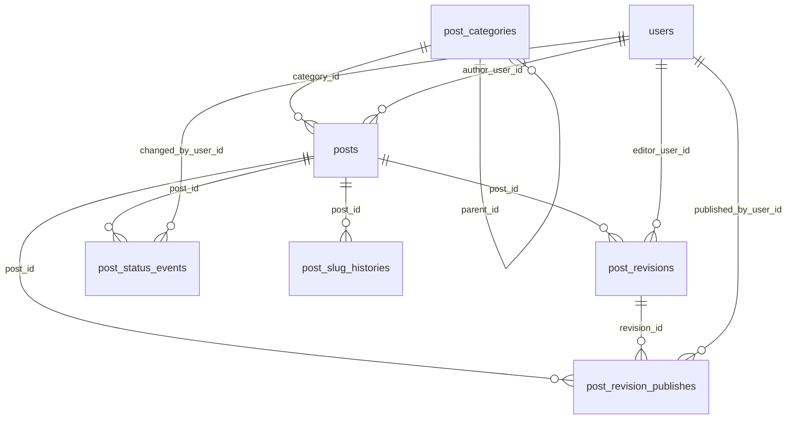

# Toko

Laravel 向けの記事管理モデルパッケージです。

English version: `README.md`

## Requirements

- PHP 8.3+
- Laravel 11 / 12

## Installation

```bash
composer require trust-medical/toko
```

必要に応じて設定ファイルを公開します:

```bash
php artisan vendor:publish --tag=toko-config
```

マイグレーションを実行します:

```bash
php artisan migrate
```

## Usage

### Models / Responsibilities

| Model / Enum | 責務 |
| --- | --- |
| `TrustMedical\Toko\Models\PostCategory` | 階層カテゴリ（親子関係・並び順）を管理する。 |
| `TrustMedical\Toko\Models\Post` | 記事のメタ情報（著者、カテゴリ、ステータス、公開日時、slug）を保持する。 |
| `TrustMedical\Toko\Models\PostRevision` | 記事本文の版管理（TipTap JSON と公開用 HTML キャッシュ）を保持する。 |
| `TrustMedical\Toko\Models\PostRevisionPublish` | どの revision がいつ誰によって公開されたかの履歴を保持する。 |
| `TrustMedical\Toko\Models\PostStatusEvent` | ステータス遷移（from/to、変更者、変更時刻）を監査ログとして保持する。 |
| `TrustMedical\Toko\Models\PostSlugHistory` | slug 変更履歴（旧slug）を保持しリダイレクト等に活用する。 |
| `TrustMedical\Toko\Enums\PostStatus` | 記事の状態（draft/scheduled/published/archived）を表す enum。 |

例:

```php
use TrustMedical\Toko\Enums\PostStatus;
use TrustMedical\Toko\Models\Post;
use TrustMedical\Toko\Models\PostCategory;

$category = PostCategory::create([
    'name' => 'News',
    'slug' => 'news',
]);

$post = Post::create([
    'author_user_id' => 1,
    'category_id' => $category->id,
    'title' => 'Hello Toko',
    'slug' => 'hello-toko',
    'status' => PostStatus::Draft,
]);
```

### Enum labels

`PostStatus` はラベル文字列を取得でき、Filament がある場合は `HasLabel` を実装します:

```php
use TrustMedical\Toko\Enums\PostStatus;

PostStatus::Draft->getLabel(); // "Draft"
```

ラベルは Laravel の翻訳に対応しており、パッケージの既定値は `toko::` 名前空間にあります:

```php
__('toko::post-status.draft'); // "Draft"（または翻訳済み）
```

ホストアプリ側で上書きする場合は翻訳ファイルを公開して編集します:

```bash
php artisan vendor:publish --tag=toko-translations
```

その後 `resources/lang/vendor/toko/{locale}/post-status.php` を編集してください。

### Scopes

`Post` には便利な scopes が含まれます:

```php
Post::draft()->latest()->get();
Post::published()->whereNotNull('published_at')->get();
Post::byAuthor($userId)->get();
Post::inCategory($categoryId)->get();
Post::publishedAt(now())->get();
Post::scheduledBetween($from, $to)->get();
Post::visible()->get();
```

`PostCategory` には階層と並び順の helper があります:

```php
PostCategory::roots()->ordered()->get();
```

### Latest published revision

最新の公開 revision を取得するユーティリティ:

```php
$latestRevision = $post->latestPublishedRevision();
```

### Publishing service

公開処理は `PostPublisher` で一元化できます:

```php
use TrustMedical\Toko\Models\Post;
use TrustMedical\Toko\Models\PostRevision;
use TrustMedical\Toko\Contracts\PostPublisherContract;

$publisher = app(PostPublisherContract::class);
$publisher->publish($post, $revision, auth()->user(), now(), 'Publish from UI');
```

### Scheduling service

予約公開は `PostScheduler` で登録できます（posts の `scheduled_at` を使用）:

```php
use TrustMedical\Toko\Contracts\PostSchedulerContract;

$scheduledAt = now()->addDay();
$scheduler = app(PostSchedulerContract::class);
$scheduler->schedule($post, $revision, $scheduledAt, auth()->user(), 'Schedule from UI');
```

予約公開の実行はコマンドで行います:

```bash
php artisan toko:publish-scheduled
```

### Slug history

`Post` の `slug` 変更は自動で履歴保存されます。

```php
$post->update(['slug' => 'new-slug']);
// post_slug_histories に old_slug が保存される
```

### Use cases

#### カテゴリごとの記事と件数をツリーで取得

```php
use TrustMedical\Toko\Models\PostCategory;

$tree = PostCategory::treeWithPublishedPosts();

// $category->posts には公開済み記事、$category->published_posts_count には件数が入る
// 子カテゴリは $category->children で取得できる
```

非公開記事も含める場合は追加条件を渡します:

```php
use TrustMedical\Toko\Models\PostCategory;

$tree = PostCategory::treeWithPosts();

// $category->posts には全記事、$category->posts_count には件数が入る
```

#### 同じカテゴリのおすすめ記事を3件取得

```php
use TrustMedical\Toko\Models\Post;

$recommended = Post::query()
    ->published()
    ->where('category_id', $post->category_id)
    ->whereKeyNot($post->id)
    ->orderByDesc('published_at')
    ->limit(3)
    ->get();
```

※ 「おすすめ」の条件はプロダクト要件に合わせて `orderBy` / `inRandomOrder` / 独自スコアなどに置き換えてください。

### User model resolution

ユーザー関連の relation は `config('auth.providers.users.model')` を参照し、未設定時は `App\Models\User` を利用します。

## ER Diagram



## Testing

テストは Orchestral Testbench を利用します。実行方法:

```bash
composer test
```

## Linting

Linting は Laravel Pint を利用します:

```bash
composer lint
```

## Static analysis

静的解析は Larastan（PHPStan）を利用します:

```bash
composer analyze
```

## Factories / Seeder

パッケージ内に Factory を同梱しています:

```php
use TrustMedical\Toko\Models\Post;
use TrustMedical\Toko\Models\PostCategory;
use TrustMedical\Toko\Models\PostRevision;

PostCategory::factory()->create();
Post::factory()->published()->create(['author_user_id' => 1]);
PostRevision::factory()->create(['editor_user_id' => 1]);
```

サンプルデータが必要な場合は `TokoSeeder` を利用できます:

```php
// database/seeders/DatabaseSeeder.php
$this->call(\TrustMedical\Toko\Database\Seeders\TokoSeeder::class);
```

## Contributing

開発方針や実行方法は `CONTRIBUTING.ja.md` を参照してください。

## Changelog

変更履歴は `CHANGELOG.md` にまとめています。

## License

MIT License. 詳細は `LICENSE` を参照してください。

## Laravel Boost integration

`resources/boost/guidelines/core.blade.php` に Boost guidelines を同梱しています。ホストアプリ側で Laravel Boost を導入すると自動的に読み込まれます。
