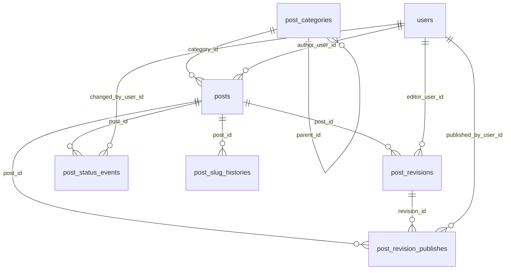

# Toko

Article management models for Laravel.

日本語版: `README.ja.md`

## Requirements

- PHP 8.3+
- Laravel 11 / 12

## Installation

```bash
composer require trust-medical/toko
```

Publish the config (optional):

```bash
php artisan vendor:publish --tag=toko-config
```

Run the migrations:

```bash
php artisan migrate
```

## Usage

### Models / Responsibilities

| Model / Enum | Responsibility |
| --- | --- |
| `TrustMedical\Toko\Models\PostCategory` | Manages hierarchical categories (parent/child, ordering). |
| `TrustMedical\Toko\Models\Post` | Stores post metadata (author, category, status, publish time, slug). |
| `TrustMedical\Toko\Models\PostRevision` | Manages content revisions (TipTap JSON + HTML cache). |
| `TrustMedical\Toko\Models\PostRevisionPublish` | Records which revision was published, when, and by whom. |
| `TrustMedical\Toko\Models\PostStatusEvent` | Audit log for status transitions (from/to, actor, timestamp). |
| `TrustMedical\Toko\Models\PostSlugHistory` | Keeps slug change history for redirects, etc. |
| `TrustMedical\Toko\Enums\PostStatus` | Enum for draft/scheduled/published/archived. |

Example:

```php
use TrustMedical\Toko\Enums\PostStatus;
use TrustMedical\Toko\Models\Post;
use TrustMedical\Toko\Models\PostCategory;

$category = PostCategory::create([
    'name' => 'News',
    'slug' => 'news',
]);

$post = Post::create([
    'author_user_id' => 1,
    'category_id' => $category->id,
    'title' => 'Hello Toko',
    'slug' => 'hello-toko',
    'status' => PostStatus::Draft,
]);
```

### Enum labels

`PostStatus` provides a label string and implements Filament's `HasLabel` when available:

```php
use TrustMedical\Toko\Enums\PostStatus;

PostStatus::Draft->getLabel(); // "Draft"
```

Labels are translatable via Laravel translations. Package defaults live under the `toko::` namespace:

```php
__('toko::post-status.draft'); // "Draft" (or translated)
```

To override in the host app, publish translations and edit the vendor files:

```bash
php artisan vendor:publish --tag=toko-translations
```

Then edit `resources/lang/vendor/toko/{locale}/post-status.php`.

### Scopes

`Post` provides convenience scopes:

```php
Post::draft()->latest()->get();
Post::published()->whereNotNull('published_at')->get();
Post::byAuthor($userId)->get();
Post::inCategory($categoryId)->get();
Post::publishedAt(now())->get();
Post::scheduledBetween($from, $to)->get();
Post::visible()->get();
```

`PostCategory` provides helpers for hierarchy and ordering:

```php
PostCategory::roots()->ordered()->get();
```

### Latest published revision

Utility to fetch the latest published revision:

```php
$latestRevision = $post->latestPublishedRevision();
```

### Publishing service

Centralize publish flow with `PostPublisher`:

```php
use TrustMedical\Toko\Models\Post;
use TrustMedical\Toko\Models\PostRevision;
use TrustMedical\Toko\Contracts\PostPublisherContract;

$publisher = app(PostPublisherContract::class);
$publisher->publish($post, $revision, auth()->user(), now(), 'Publish from UI');
```

### Scheduling service

Schedule a publish with a fixed revision (uses `scheduled_at` on posts):

```php
use TrustMedical\Toko\Contracts\PostSchedulerContract;

$scheduledAt = now()->addDay();
$scheduler = app(PostSchedulerContract::class);
$scheduler->schedule($post, $revision, $scheduledAt, auth()->user(), 'Schedule from UI');
```

Process scheduled posts via command:

```bash
php artisan toko:publish-scheduled
```

### Scheduler setup

Register the scheduled command in `routes/console.php`:

```php
use Illuminate\Support\Facades\Schedule;

Schedule::command('toko:publish-scheduled')
    ->everyMinute()
    ->withoutOverlapping();
```

Add a single cron entry on the server to run Laravel's scheduler:

```bash
* * * * * cd /path-to-your-project && php artisan schedule:run >> /dev/null 2>&1
```

For local development, you can run:

```bash
php artisan schedule:work
```

### Slug history

`Post` slug changes are stored automatically:

```php
$post->update(['slug' => 'new-slug']);
// old_slug is written to post_slug_histories
```

### Use cases

#### Get category tree with posts and counts

```php
use TrustMedical\Toko\Models\PostCategory;

$tree = PostCategory::treeWithPublishedPosts();

// $category->posts holds published posts
// $category->published_posts_count holds the count
// child categories are available via $category->children
```

Include non-public posts:

```php
use TrustMedical\Toko\Models\PostCategory;

$tree = PostCategory::treeWithPosts();

// $category->posts holds all posts
// $category->posts_count holds the count
```

#### Get 3 recommended posts in the same category

```php
use TrustMedical\Toko\Models\Post;

$recommended = Post::query()
    ->published()
    ->where('category_id', $post->category_id)
    ->whereKeyNot($post->id)
    ->orderByDesc('published_at')
    ->limit(3)
    ->get();
```

Replace the recommendation rule with `orderBy`, `inRandomOrder`, or a custom score based on your product requirements.

### User model resolution

User relations resolve via `config('auth.providers.users.model')` and fall back to `App\Models\User`.

## ER Diagram



## Testing

This package uses Orchestral Testbench:

```bash
composer test
```

## Linting

Linting uses Laravel Pint:

```bash
composer lint
```

## Static analysis

Static analysis uses Larastan (PHPStan):

```bash
composer analyze
```

## Factories / Seeder

Factories are bundled:

```php
use TrustMedical\Toko\Models\Post;
use TrustMedical\Toko\Models\PostCategory;
use TrustMedical\Toko\Models\PostRevision;

PostCategory::factory()->create();
Post::factory()->published()->create(['author_user_id' => 1]);
PostRevision::factory()->create(['editor_user_id' => 1]);
```

Use `TokoSeeder` for sample data:

```php
// database/seeders/DatabaseSeeder.php
$this->call(\TrustMedical\Toko\Database\Seeders\TokoSeeder::class);
```

## Contributing

See `CONTRIBUTING.md` for development guidelines.

## Changelog

See `CHANGELOG.md` for release history.

## License

MIT License. See `LICENSE` for details.

## Laravel Boost integration

Boost guidelines are shipped at `resources/boost/guidelines/core.blade.php`. When Laravel Boost is installed in the host app, these guidelines are picked up automatically.
