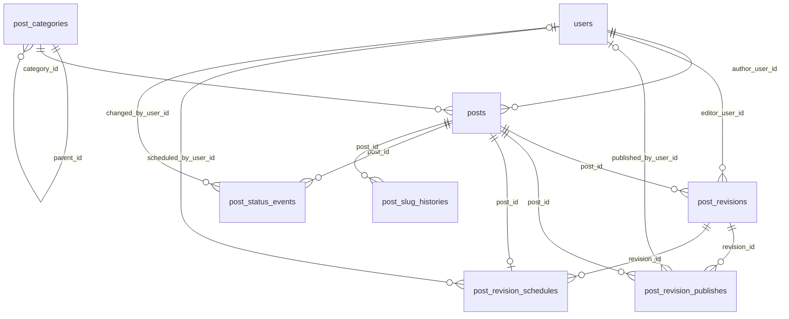
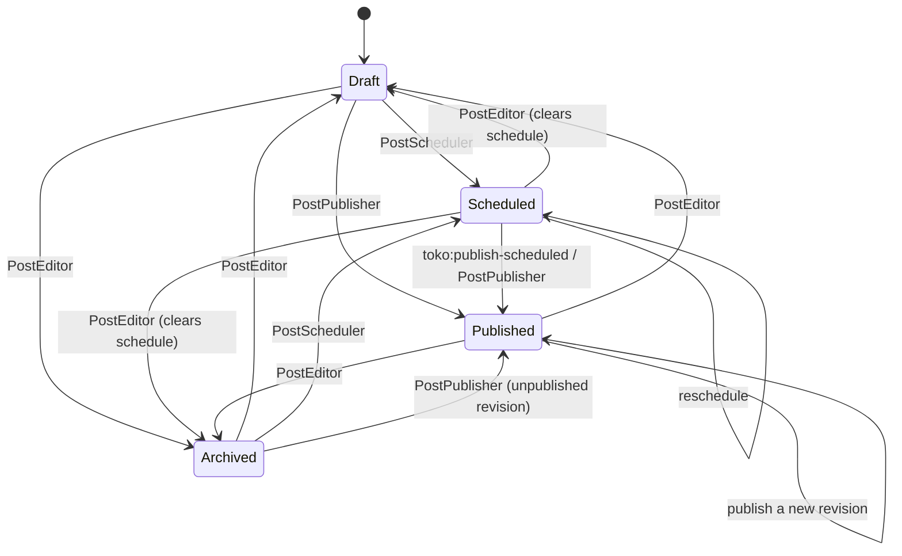

# Toko

Article management models and services for Laravel: hierarchical categories, posts, immutable revisions, publish history, scheduled publishing, status audit logs and slug history.

日本語版: [README.ja.md](README.ja.md)

## Table of contents

- [Features](#features)
- [Requirements](#requirements)
- [Installation](#installation)
- [Concepts](#concepts)
- [Status lifecycle](#status-lifecycle)
- [Quick start](#quick-start)
- [Services](#services)
- [Scheduled publishing](#scheduled-publishing)
- [Querying](#querying)
- [Slug history](#slug-history)
- [Events](#events)
- [Configuration](#configuration)
- [Status labels and colors](#status-labels-and-colors)
- [User model](#user-model)
- [Customizing services](#customizing-services)
- [Factories and seeder](#factories-and-seeder)
- [Laravel Boost integration](#laravel-boost-integration)
- [Upgrading](#upgrading)
- [Development](#development)

## Features

- **Hierarchical categories**: parent/child tree with sort order and tree builders that eager-load posts and counts.
- **Posts and revisions**: a `Post` holds the current (public) values, and every edit becomes an immutable `PostRevision` (TipTap JSON + rendered HTML).
- **Publishing workflow**: services for create/update, publish, schedule and restore. Each one runs in a DB transaction and validates its input before touching the database.
- **Scheduled publishing**: an artisan command publishes due posts. Failures are isolated per post.
- **Audit trail**: publish history (which revision, when, by whom) and status transition events.
- **Slug history**: old slugs are recorded automatically for 301 redirects.
- **Events** for publish, status change and slug change.
- **Filament-friendly** `PostStatus` enum with translatable labels and colors.

## Requirements

- PHP 8.3+
- Laravel 12 or 13
- A `users` table with integer primary keys (the foreign keys reference `users.id`)

## Installation

```bash
composer require trust-medical/toko
```

The service provider is auto-discovered. Run the migrations:

```bash
php artisan migrate
```

Optionally publish the config and translations:

```bash
php artisan vendor:publish --tag=toko-config
php artisan vendor:publish --tag=toko-translations
```

If you use scheduled publishing, register the command with the Laravel scheduler (see [Scheduled publishing](#scheduled-publishing)).

## Concepts

| Model / Enum | Responsibility |
| --- | --- |
| `PostCategory` | Hierarchical category (adjacency list `parent_id`, `sort_order`). |
| `Post` | Current values of an article: author, category, title, excerpt, slug, status, `published_at`, `scheduled_at`. |
| `PostRevision` | Immutable version of the content: title, excerpt, slug, `content_json` (TipTap), `content_html`, editor metadata. |
| `PostRevisionPublish` | Publish history: which revision was published, when, and by whom (nullable for system publishes). |
| `PostRevisionSchedule` | The pending scheduled publish of a post (at most one per post). |
| `PostStatusEvent` | Audit log of status transitions (from/to, who, when, note). |
| `PostSlugHistory` | Old slugs of posts, for redirects. |
| `PostStatus` | Enum: `Draft` (0), `Scheduled` (1), `Published` (2), `Archived` (3). |

All models live in `TrustMedical\Toko\Models`, and the enum lives in `TrustMedical\Toko\Enums`.

Key ideas:

- **Revisions are the source of truth for content.** Editing a post creates a new revision. When a revision is published, its `title` / `excerpt` / `slug` are copied to the `Post`. A `null` value on the revision keeps the post's current value.
- **A published post is only changed by publishing.** While a post is published, `title` / `excerpt` / `slug` on the post are not updated directly. Save a new revision and publish it instead.
- **One publish per revision.** The same revision cannot be published twice. To bring an old revision back, restore it (which creates a new revision) and publish that.
- **Use the services for state changes.** The models are plain Eloquent models, so you *can* write `status` directly, but only the services keep the publish history, schedules and status events consistent.

### ER diagram



## Status lifecycle



Rules:

- `Published → Scheduled` is **not allowed**. To schedule an update of a live post, unpublish it first, or publish the new revision when it is ready.
- Re-publishing (`Published → Published`) and rescheduling (`Scheduled → Scheduled`) do not record a `PostStatusEvent` and do not dispatch `PostStatusChanged`, because the status does not change. The publish history still records every publish.
- Leaving `Scheduled` for any status deletes the pending schedule and clears `scheduled_at`.
- `published_at` may be in the future. The post is then `Published` but hidden from `visible()` until that time.

## Quick start

```php
use TrustMedical\Toko\Contracts\PostEditorContract;
use TrustMedical\Toko\Contracts\PostPublisherContract;
use TrustMedical\Toko\Contracts\PostRevisionRestorerContract;
use TrustMedical\Toko\Enums\PostStatus;
use TrustMedical\Toko\Models\PostCategory;

$category = PostCategory::create(['name' => 'News', 'slug' => 'news']);
$editor = app(PostEditorContract::class);
$user = auth()->user();

// 1. Create a draft (post + first revision)
$post = $editor->create(
    ['category_id' => $category->id, 'slug' => 'hello-toko'],
    [
        'title' => 'Hello Toko',
        'content_json' => $tiptapJson,
        'content_html' => $html,
    ],
    author: $user,
);

// 2. Save another draft revision
$post = $editor->update($post, [], [
    'title' => 'Hello Toko (v2)',
    'content_json' => $tiptapJson,
    'content_html' => $html,
], $user);

// 3. Publish the latest revision
$post = $editor->update($post, ['status' => PostStatus::Published], [], $user, 'First release');

// 4. Later: fix a typo on the live post and publish the fix
$post = $editor->update($post, [], ['title' => 'Hello, Toko', 'content_json' => $tiptapJson, 'content_html' => $html], $user);
app(PostPublisherContract::class)->publish($post, $post->revisions()->latest('id')->first(), $user);

// 5. Roll back to the first revision
$first = $post->revisions()->oldest('id')->first();
$restored = app(PostRevisionRestorerContract::class)->restore($post, $first, $user);
app(PostPublisherContract::class)->publish($post->fresh(), $restored, $user, note: 'Rollback');
```

## Services

Resolve the services through their contracts (`app(...)` or constructor injection). They are bound as singletons by `TokoServiceProvider`.

Invalid input raises `InvalidArgumentException` before anything is written, and every service runs in a DB transaction.

### PostEditor

`TrustMedical\Toko\Contracts\PostEditorContract`: a high-level API for forms and admin screens.

```php
create(array $postAttributes, array $revisionAttributes, ?Model $author = null, ?Model $editor = null, ?string $note = null): Post
update(Post $post, array $postAttributes = [], array $revisionAttributes = [], ?Model $changedBy = null, ?string $note = null): Post
```

**`create()`**

- Creates the post **as `Draft`** together with its first revision. If the requested `status` (or `config('toko.default_status')`) is not `Draft`, the post is then moved to that status through the publisher, the scheduler or a status event.
- `author_user_id` (or `$author`) and `category_id` are required.
- `title` / `excerpt` / `slug` fall back from the revision attributes to the post, and the other way around.
- The revision editor is `editor_user_id` from the revision attributes, else `$editor`, else `$author`.
- `status => Scheduled` requires `scheduled_at`. `status => Published` accepts an optional `published_at`.

**`update()`**

- Post attributes are saved first. While the post is (or is becoming) `Published`, `title` / `excerpt` / `slug` are **ignored** here, because they come from the revision when it is published.
- Non-empty `$revisionAttributes` create a new revision.
- Changing `status` to `Published` or `Scheduled` uses the new revision if one was created, otherwise **the latest revision** of the post.
- While `Scheduled`, passing `scheduled_at`, a new revision or a `$note` reschedules through `PostScheduler`, so the same validation applies. `$changedBy` is required.
- `scheduled_at` is ignored unless the post is `Scheduled`, and `published_at` is ignored while it is `Scheduled`.

### PostPublisher

`TrustMedical\Toko\Contracts\PostPublisherContract`

```php
publish(Post $post, PostRevision $revision, ?Model $publishedBy = null, ?DateTimeInterface $publishedAt = null, ?string $note = null): PostRevisionPublish
```

- Requires the revision to belong to the post, have `content_html` (configurable) and not have been published before.
- Creates a `PostRevisionPublish` and copies `title` / `excerpt` / `slug` to the post. It sets `status = Published` and `published_at` (default `now()`), and deletes any pending schedule.
- `$publishedBy` may be `null` for system publishes.
- Records a status event and dispatches `PostStatusChanged` only when the status actually changes. It always dispatches `PostPublished`.

### PostScheduler

`TrustMedical\Toko\Contracts\PostSchedulerContract`

```php
schedule(Post $post, PostRevision $revision, DateTimeInterface $scheduledAt, ?Model $scheduledBy = null, ?string $note = null): PostRevisionSchedule
```

- Requires `$scheduledBy`, a revision of the post with `content_html` (configurable), and a post that is **not** `Published`.
- Stores the schedule (one per post, and an existing one is replaced), sets `status = Scheduled`, sets `scheduled_at`, and clears `published_at`.

### PostRevisionRestorer

`TrustMedical\Toko\Contracts\PostRevisionRestorerContract`

```php
restore(Post $post, PostRevision $revision, ?Model $restoredBy = null, ?string $note = null): PostRevision
```

- Copies the revision into a **new** revision. The default change note is `Restore from revision #<id>`.
- If the post is not published, its `title` / `excerpt` / `slug` are updated immediately. If it is published, publish the returned revision to make it live.

## Scheduled publishing

```bash
php artisan toko:publish-scheduled            # up to 100 due posts
php artisan toko:publish-scheduled --limit=500
```

- Picks up posts in `Scheduled` status whose `scheduled_at` has passed, oldest first, and publishes the scheduled revision. `published_at` is set to `scheduled_at`.
- Each post is locked and published in its own transaction. If one fails (for example, its content is missing), the error is reported, the command moves on to the next post, and it exits with a non-zero code.
- If the user who scheduled it no longer exists, the post is still published, with a `null` publisher.

Register it in `routes/console.php`:

```php
use Illuminate\Support\Facades\Schedule;

Schedule::command('toko:publish-scheduled')
    ->everyMinute()
    ->withoutOverlapping();
```

Then run the Laravel scheduler from cron (or run `php artisan schedule:work` locally):

```bash
* * * * * cd /path-to-your-project && php artisan schedule:run >> /dev/null 2>&1
```

## Querying

### Post scopes

| Scope | Meaning |
| --- | --- |
| `status(PostStatus\|int $status)` | Filter by status |
| `draft()` / `scheduled()` / `published()` / `archived()` | Shortcut for each status |
| `byAuthor(int $userId)` | Filter by author |
| `inCategory(int $categoryId)` | Filter by category (direct only) |
| `publishedAt(?DateTimeInterface $at = null)` | `Published` with `published_at <= $at` (default now) |
| `visible(?DateTimeInterface $at = null)` | Alias of `publishedAt()`, meaning what the public can see |
| `scheduledBetween($from, $to)` | `Scheduled` with `scheduled_at` in the range |

```php
use TrustMedical\Toko\Models\Post;

Post::visible()->latest('published_at')->paginate();
Post::draft()->byAuthor(auth()->id())->latest()->get();
Post::scheduledBetween(now(), now()->addWeek())->get();
```

### Revisions and history

```php
$post->revisions;                  // all revisions
$post->latestPublishedRevision();  // revision of the most recent publish (null if never published)
$post->revisionPublishes;          // publish history
$post->revisionSchedule;           // pending schedule, if any
$post->statusEvents;               // status transitions
$post->slugHistories;              // old slugs
```

### Category trees

```php
use TrustMedical\Toko\Models\PostCategory;

// Roots with nested ->children, each with published ->posts and ->published_posts_count
$tree = PostCategory::treeWithPublishedPosts();

// Every post regardless of status, with ->posts_count
$tree = PostCategory::treeWithPosts();

// Extra conditions apply to both the eager-loaded posts and the counts
$tree = PostCategory::treeWithPublishedPosts(fn ($query) => $query->where('published_at', '<=', now()));

PostCategory::roots()->ordered()->get();
```

The counts cover posts directly in each category. Posts in descendant categories are not included.

### Related posts in the same category

```php
$related = Post::visible()
    ->inCategory($post->category_id)
    ->whereKeyNot($post->id)
    ->latest('published_at')
    ->limit(3)
    ->get();
```

## Slug history

When a post's slug changes, the old slug is saved to `post_slug_histories`. This happens after the update succeeds, so a failed update leaves no history behind.

- An old slug belongs to the post that used it most recently.
- A slug that becomes live again (on any post) is removed from the history.
- Disable it with `toko.slug_history.enabled = false`.

A typical redirect lookup:

```php
use TrustMedical\Toko\Models\Post;
use TrustMedical\Toko\Models\PostSlugHistory;

$post = Post::visible()->where('slug', $slug)->first();

if ($post === null) {
    $history = PostSlugHistory::with('post')->where('old_slug', $slug)->first();
    abort_if($history === null, 404);

    return redirect()->route('posts.show', $history->post->slug, 301);
}
```

## Events

| Event | Payload | Dispatched when |
| --- | --- | --- |
| `TrustMedical\Toko\Events\PostPublished` | `post`, `revision`, `publish`, `publishedBy` | Every publish |
| `TrustMedical\Toko\Events\PostStatusChanged` | `post`, `from`, `to`, `changedBy` | The status actually changes through a service |
| `TrustMedical\Toko\Events\PostSlugChanged` | `post`, `oldSlug`, `newSlug` | A saved post's slug changed |

Events are dispatched inside the service's DB transaction. For side effects such as cache purges or notifications, implement `ShouldHandleEventsAfterCommit` (or queue the listener with `afterCommit`).

## Configuration

`config/toko.php` (publish with `--tag=toko-config`):

| Key | Default | Description |
| --- | --- | --- |
| `default_status` | `PostStatus::Draft` | Target status of `PostEditor::create()` when no `status` is given |
| `slug_history.enabled` | `true` | Record old slugs |
| `publishing.require_content_html` | `true` | Require `content_html` when publishing or scheduling |

## Status labels and colors

`PostStatus` implements `HasLabel` and `HasColor`. If Filament is installed, these extend Filament's contracts, so the enum works directly in Filament tables and forms.

```php
PostStatus::Draft->getLabel();    // "Draft" (translated via toko::post-status.draft)
PostStatus::Published->getColor(); // "success"
```

English and Japanese translations are bundled. To override them, publish `toko-translations` and edit `lang/vendor/toko/{locale}/post-status.php`.

## User model

User relations (`author`, `editorUser`, `publishedBy`, `scheduledBy`, `changedBy`) resolve to `config('auth.providers.users.model')`, falling back to `App\Models\User`.

## Customizing services

Every service is bound by contract, so you can swap an implementation in your own service provider:

```php
use TrustMedical\Toko\Contracts\PostPublisherContract;

$this->app->singleton(PostPublisherContract::class, App\Toko\MyPublisher::class);
```

`PostEditor` receives the publisher and scheduler through their contracts, so a replacement is picked up everywhere.

## Factories and seeder

```php
use TrustMedical\Toko\Models\Post;
use TrustMedical\Toko\Models\PostCategory;
use TrustMedical\Toko\Models\PostRevision;

PostCategory::factory()->create();
Post::factory()->published()->create(['author_user_id' => $user->id]);
Post::factory()->scheduled()->create(['author_user_id' => $user->id]); // uses scheduled_at
PostRevision::factory()->create(['editor_user_id' => $user->id]);
```

Factories write the models directly and do not create publish history. For realistic data, use the services. For sample data, call the bundled seeder:

```php
$this->call(\TrustMedical\Toko\Database\Seeders\TokoSeeder::class);
```

## Laravel Boost integration

Guidelines ship in `resources/boost/guidelines/core.blade.php` and are picked up automatically when the host app uses [Laravel Boost](https://github.com/laravel/boost).

## Upgrading

### 0.8 → 0.9

No code or schema changes are required. The package now supports **Laravel 12 and 13** (`laravel/framework` `^12.0|^13.0`). Update with `composer update trust-medical/toko`.

### 0.7 → 0.8

1. Make sure the app runs on **Laravel 12**. Laravel 11 is no longer supported, because it is past end of life and has unpatched security advisories. Then update the package with `composer update trust-medical/toko`.
2. Run `php artisan migrate` **before** the new code starts publishing (for example, before `toko:publish-scheduled` runs again). The migration makes `post_revision_publishes.published_by_user_id` nullable. Test it on a staging copy of your database first.
3. Check existing data for states the services no longer produce. Posts created directly or with the old `scheduled()` factory state may need fixing:

   ```php
   // Scheduled posts without a schedule record, or without scheduled_at, are never picked up by the command
   Post::scheduled()->where(fn ($q) => $q->whereDoesntHave('revisionSchedule')->orWhereNull('scheduled_at'))->get();
   // Scheduled posts that still have published_at, or non-scheduled posts that still have scheduled_at
   Post::scheduled()->whereNotNull('published_at')->get();
   Post::where('status', '!=', PostStatus::Scheduled)->whereNotNull('scheduled_at')->get();
   // Old slugs that are live again
   PostSlugHistory::whereIn('old_slug', Post::select('slug'))->get();
   ```

Behavior changes:

- `PostScheduler::schedule()` throws for posts that are `Published`.
- `PostPublisher::publish()` throws when the revision has already been published. Restore it as a new revision instead.
- Re-publishing a published post or rescheduling a scheduled post no longer records a status event or dispatches `PostStatusChanged`.
- `PostEditor::create()` always creates the post as `Draft` before moving it to the target status, and it validates `author_user_id` / `category_id`.
- `PostEditor::update()` falls back to the latest revision when publishing or scheduling without a new revision. Rescheduling goes through `PostScheduler`.
- The `$publishedAt` / `$scheduledAt` parameters now accept any `DateTimeInterface`. Custom implementations of the contracts must update their signatures.
- Slug history is written after a successful update, and an old slug now belongs to the post that used it most recently. `PostSlugChanged` is now dispatched from the `updated` model event, after the row is saved, instead of from `updating`.
- `toko:publish-scheduled` keeps going when a single post fails, and it exits with a non-zero code. Point your monitoring at the exit code or the logs.
- `PostRevisionPublish::$publishedBy` can be `null`. Handle that wherever you display the publisher.
- The package now requires `laravel/framework` ^12.0 instead of individual `illuminate/*` packages. Laravel 11 support has been dropped.

See [CHANGELOG.md](CHANGELOG.md) for details.

## Development

```bash
composer install
composer test      # PHPUnit (Orchestral Testbench, in-memory SQLite)
composer lint      # Laravel Pint
composer analyze   # Larastan (PHPStan level 6)
```

Without a local PHP, run the same commands in Docker:

```bash
docker run --rm -u "$(id -u):$(id -g)" -v "$PWD":/app -w /app composer:2 composer test
```

See [CONTRIBUTING.md](CONTRIBUTING.md) for guidelines.

## License

MIT License. See [LICENSE](LICENSE).
